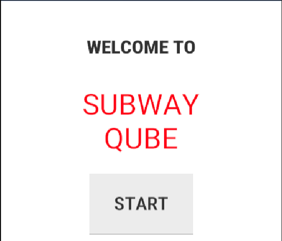
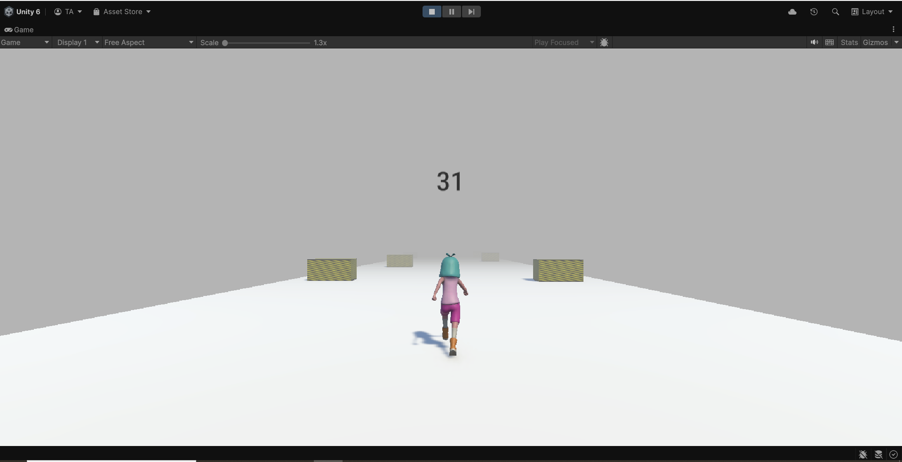
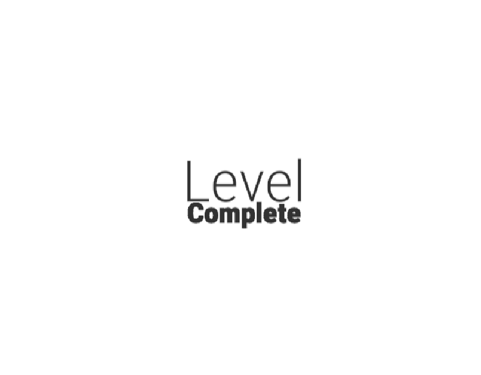
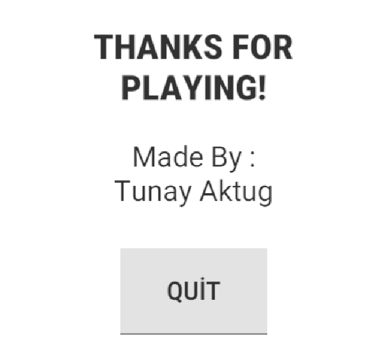

# Subway Qube (Unity - C#)

A simple endless runner prototype made in Unity.  
Avoid obstacles, rack up your score, and complete the level while running endlessly through the subway lanes.

---

> Welcome screen of the game

---

## Built With

- **Unity Engine (3D)**
- **C# scripting**
- Rigidbody-based character controller
- UI system for score, level completion, and game flow
- Custom level complete animation

---

## Gameplay Overview

- Press **Start** to begin running forward automatically.
- Use `A` and `D` keys to move left and right.
- Avoid obstacles (yellow-striped blocks).
- Score increases based on distance traveled.
- Reach the finish trigger to **complete the level**.
- If you fall or hit an obstacle, the game restarts after a short delay.

---

> In-game screenshot with obstacles, fog effect, score display and running animation

---

## Script Breakdown

| Script | Description |
|--------|-------------|
| `PlayerMovement.cs` | Handles forward and sideways movement using physics |
| `PlayerCollision.cs` | Detects collisions with obstacles and ends the game |
| `Score.cs` | Updates score text based on player's Z position |
| `FollowPlayer.cs` | Keeps the camera behind the player using an offset |
| `Menu.cs` | Loads the first level when "Start" is pressed |
| `GameManager.cs` | Manages game over, level complete UI, and restarts |
| `EndTrigger.cs` | Detects level completion when player passes the trigger |
| `LevelComplete.cs` | Loads the next level |
| `Credits.cs` | Handles quitting the game on the final screen |

---

## Features

- Endless forward movement
- Obstacle collision and game over system
- Dynamic score system (based on player distance)
- Level completion UI and transition
- Custom-made “Level Complete” animation
- Final screen with creator credits

---

> Level complete animation (custom created)

---

## Controls

| Key | Action |
|-----|--------|
| `A` | Move left |
| `D` | Move right |

---

## Ending Screen

> Final credits screen after finishing the level

---

## How to Run

1. Clone or download this repository.
2. Open it in Unity (2021.3+ recommended).
3. Press **Play** and enjoy the run!

---

## Note

The game currently includes **3 levels** and is fully **expandable** for future development.
